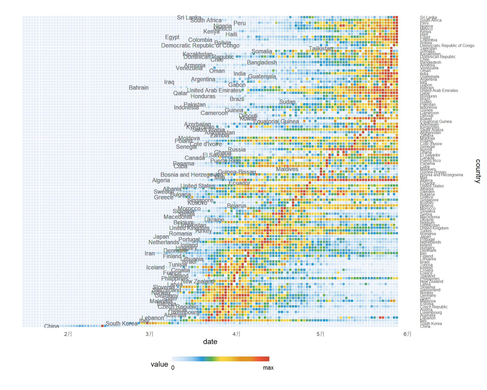
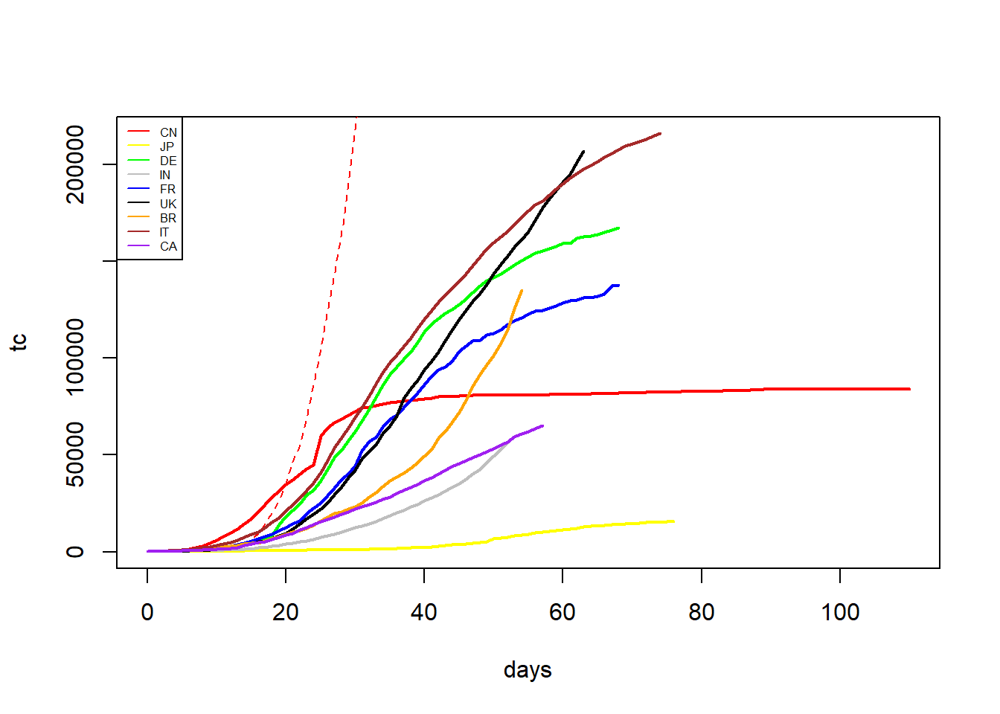
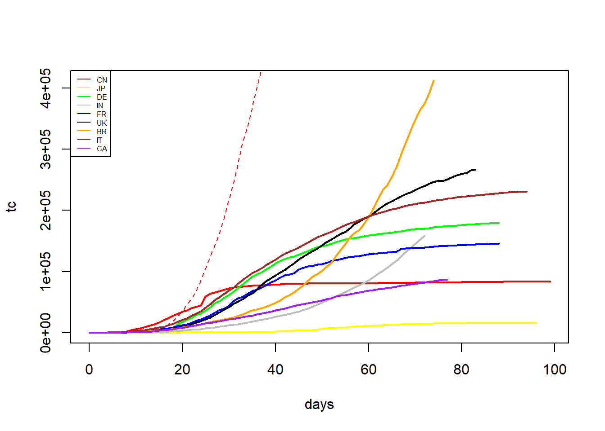
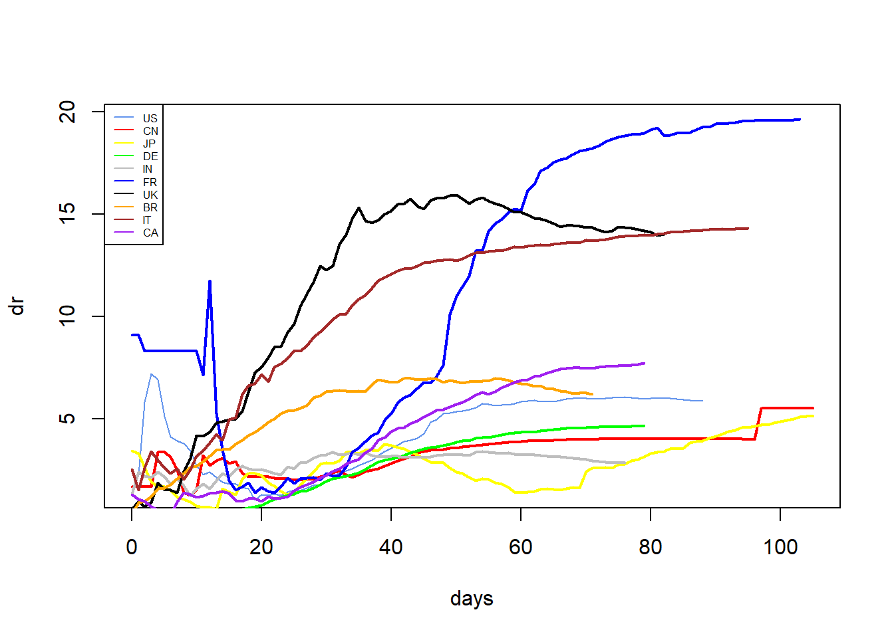

```{r setup, include=FALSE}
knitr::opts_chunk$set(echo = FALSE)
```

## 每日新增病例比较

　　对每个国家/地区的新病例的进行归一化（（1）式），范围从0到1。
$$
f(x)=\frac {x-min(x)}{max(x)-min(x)} 
$$
　　为了进行详细的分析，图中各国家/地区根据单日新增病例最大值从下到上排序。从图中可以看到，1月的下旬COVID-19开始在中国爆发，到三月左右国内疫情基本得到控制，每日新增数变得很少；紧随中国之后的是韩国，3月初出现单日新增最大值（首现拐点），持续了几天数量较大的单日新增，之后单日新增数量保持在较小值的一定范围波动。

---------------------------------------------

```{r, out.height="110%", out.width="110%", echo=FALSE}

```

## GDP_top10 各国疫情发展态势比较

1.各国累计确诊病例比较

　　为了直观的比较各国疫情时间发展，横轴取各国第100例病人确诊的时间作为起始点，由于美国累计确诊人数较多，纵轴数值较大，导致其他国家的累计确诊人数的曲线轨迹不明显；因此取这十个国家中累计确诊人数第二多的巴西作为纵轴取值标准。

2.各国死亡率比较

　　由于各国确诊人数相差较大，比较各国累计死亡人数意义不大。这里将采用COVID-19各国累计死亡人数占累计确诊人数的比例来作为死亡率，公式为：
　　$$dr=\frac {TotalDeaths}{TotolCases}*100  $$

---------------------------------------------

```{r, out.height="100%", out.width="100%", echo=FALSE}

```

---------------------------------------------

```{r, out.height="100%", out.width="100%", echo=FALSE}

```


---------------------------------------------

```{r, out.height="100%", out.width="100%", echo=FALSE}

```
