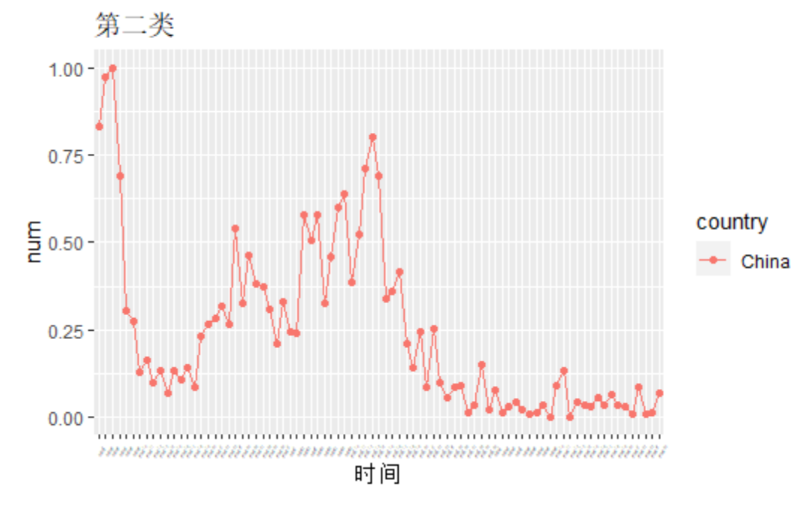

```{r setup, include=FALSE}
knitr::opts_chunk$set(echo = FALSE)
```
## 聚类分析

### 基本思想
　　简单地说，聚类分析的基本思想是“物以类聚”，把一些相似程度较大的样品（或指标）聚合为一类，另外一些彼此之间相似程度较大的样品（或指标）聚合为另一类。  
  
### 距离系数
　　类间距距离计算方法多种多样，有马氏距离，兰氏距离等等。这里采用离差平方和的方法来计算类间距离。

## 数据来源与处理

### 数据来源

数据来源于美国约翰斯·霍普金斯大学发布的疫情数据。选取的是2019年GDP前10的国家于3月3日至5月25日的每日新增病例的数据.


### 数据处理

1、原始数据中存在许多异常值，例如负值或者0值，又或者突然出现极大值，首先查阅相关疫情报道对这些数据进行修正。

2、由于各个国家病例数相差较大，所以这里对每个国家/地区的新病例的进行归一化，范围从0到1。

$$
f(x)=\frac {x-min(x)}{max(x)-min(x)}
$$


## 聚类结果

```{r fig.align='center', echo=FALSE}

```
根据上图可知：  
第一类：加拿大、日本   
第二类：中国     
第三类：意大利、德国、法国   
第四类：巴西和印度    
第五类：美国和英国  


## 各类国家疫情发展情况

### 第一类：加拿大和日本

```{r fig.align='center', echo=FALSE}

```

　　这两个国家是疫情防控措施做的比较好的国家，日本国内疫情每日新增人数最多未超过千人；加拿大同样也在抗疫期间逐步升级其防控力度，但目前加拿大的疫情形势仍然严峻。

## 第二类：中国

```{r fig.align='center', echo=FALSE}

```
  
　　从3月份以来,国内疫情基本得到了控制，过程中出现一次波动，可能对应于国内出现无症状患者的情况，但这一情况很快也得到了控制。现在，国内的每日新增病例基本维持在2位数以内。

## 第三类：意大利、德国、法国

```{r fig.align='center', echo=FALSE}

```
  
　　这些国家都是欧洲国家，其中，以意大利为代表，从3月份以来，疫情迅速爆发，呈现出指数增长的趋势，后来逐步采取封城、强制佩戴口罩等措施进行防控，现在，这些国家的疫情基本得到了控制，国家开始逐步解封。

## 第四类：巴西和印度

```{r fig.align='center', echo=FALSE}

```
  
　　这两个国家的疫情情况仍然处于一种迅速爆发的状态，近期，巴西每日新增确诊人数近2万人，成为除美国之外全球第二个疫情重灾区；印度的疫情也同样处于一个发展的状态，从图上也可以看出这两个国家每日确诊人数正在快速增加。

## 第五类：美国和英国

```{r fig.align='center', echo=FALSE}

```

　　美国是全球范围内疫情最为严重的国家，英国是欧洲疫情最为严重的国家，疫情均未得到很好的控制，仍在持续发展的状态，取得战疫的胜利还需要一段时间。