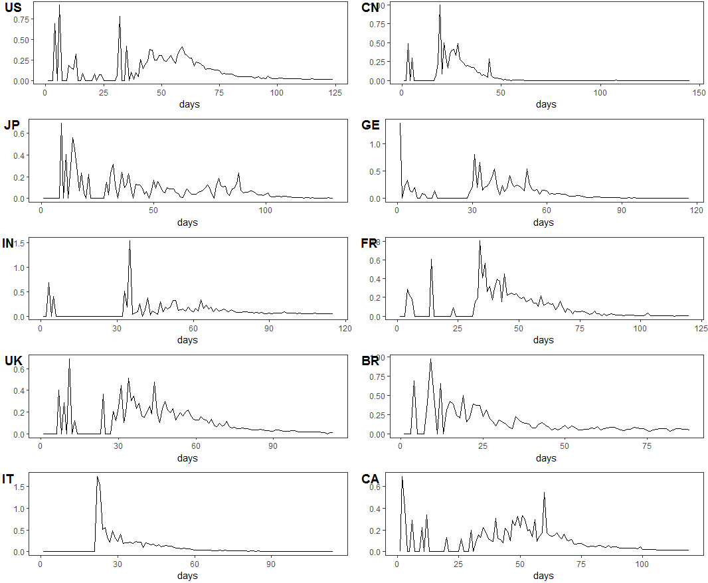

## COVID-19预测预报非线性模型及其机理简介

本章节通过拟合患者比例和增长率的变化来分析疫情趋势，将复杂的外界影响因素视为患者数量增长的环境压力，以拟合生态增长曲线的方式解读2019-nCoV病毒的感染患者例数变化，分析国内外COVID-19疫情现状并预估发展趋势。


在时间序列里，有些变量的增长量最初比较小，随时间的增加逐渐增长而达到一个快速增长时期，而后增长速度趋缓，最终达到稳定的总增长量，这一过程若用曲线来表示，则是一种拉长的S形曲线。这种S形曲线因变量的增长特性的不同而呈现出多样性变化。通常传染病的累计病例遵循S形曲线增长。Logistic函数是一种常见的S形函数,在分析COVID-19疫情变化时，可以将患者看作在限定环境中数量增长的物种，实际中病毒的传播也存在人为管控或自然阻力，因此2019-nCoV病毒的感染者例数不会无限制的增长，在一定空间范围内应符合Logistic增长曲线。


## 数据说明

本章节选用2019年GDP前十的国家：美国、中国、日本、德国、印度、法国、英国、巴西、意大利和加拿大。对GDP-TOP10的国家自2019年12月31日至2020年5月24日COVID-19累计确诊病例进行拟合和预测，以及对GDP-TOP10的国家最终流行规模的预测值进行比较。同时，计算GDP-TOP10的国家自2019年12月31日至2020年5月24日每日确诊增长率数值辅助开展分析，预估GDP-TOP10的国家发展趋势。

## 方法说明

**(1) 曲线拟合方法**

曲线拟合（curve fitting）是指选择适当的曲线类型来拟合观测数据，并用拟合的曲线方程分析变量之间的关系。本章节将每日累计确诊病例数据制成散点图，采用单个变化量对时间的响应进行非线性回归拟合，取得拟合方程的系数，并绘制回归曲线。
 
结合$S$值、$R^2$值对拟合程度进行判断，其中$S$值描述了数据值与拟合值的距离，表示评估模型描述响应值的程度，其值越低，模型描述响应的程度越高；$R^2$值是度量拟合优度的统计量，介于$0-1$之间，也称拟合的确定系数，$R^2$越高可表示拟合优度越高。$S$值和$R^2$值表达式如下所示：
$$S = \sum_{i=1}^{n}\qquad(y_i-\hat{y_i})$$
$$R^2=1-\frac {SSE*(n-k)}{(var(y))*(n-1)}$$

---------------------------------------------

**(2) Logistic 增长曲线**

本章节所采用的R包为**nlrwrb**包中的**nls()**函数，相关使用可参考《Nonlinear Regression with R》。函数**nls()**自带一组自启动函数，即"self-starter functions"，其可以自动设置初始值，Logistic的自启动函数为$SSlogis(x,Asym,xmid,scal)$，其表达式为：

$$\frac{Asym}{(1 + exp(\frac{xmid−x}{scal}))}$$与Logistic函数表达式略有不同，此处参数$Asym$代表渐近线的数字参数，其值可被作为最终流行规模的预测值，及Logistic函数表达式中的$K$值，参数$xmid$表示曲线拐点处的值，参数$scal$表示x轴上的数字比例参数。


**(3) 每日确诊增长率数值**

本章节所采用的每日确诊增长率数值的表达式为：$$r(t):=log(\frac{P(t)}{P(t-1)})$$
参考《neralized logistic growth modeling of the COVID-19 outbreak in 29 provinces in China and in the rest of the world》


## 累计确诊病例回归结果分析

```{r, out.height="100%", out.width="100%", echo=FALSE}

```

## 累计确诊病例回归拟合分析

```{r, out.height="70%", out.width="70%", echo=FALSE}

```

## 每日确诊增长率趋势分析

```{r, out.height="70%", out.width="70%", echo=FALSE}

```

## 结论

综上诉述，中国疫情已经得到控制，疫情防范效果最为突出，是十个国家最先也是最短时间将疫情控制住的国家，也体现我们国家领导人坚持“不计成本，生命至上，人民至上”的原则。日本疫情也基本得到控制，是十个国家第二位将疫情控制住的国家。德国、法国、意大利这三个国家疫情形势相似，疫情也基本得到控制。印度和巴西这两个国家疫情形势较为相似，是十个国家中疫情还仍未达到拐点的两个国家，这两个国家累计确诊病例仍会继续大幅增加，政府应加强管理措施。美国、英国、加拿大这三个国家疫情形势接近，疫情态势还不太明朗。