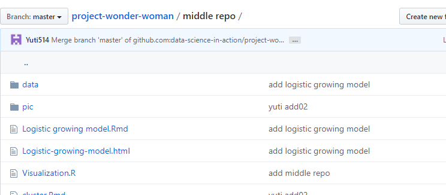
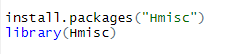

```{r setup, include=FALSE}
knitr::opts_chunk$set(echo = FALSE)
```
## 目录
<br><br><br><br>
- **01  聚类分析**
<br><br>
- **02  数据及方法**
<br><br>
- **03  实证分析**
<br><br>
- **04  复工复产建议**


## 1.聚类分析

<br>
**1.1基本思想**


<br>
由于研究的样品或指标（变量）之间存在着程度不同的相似性（亲疏关系），故可根据一批样本的多个观测指标，具体找出一些能够度量样品或指标之间相似程度的统计量，以这些统计量为划分类型的依据，把一些相似程度较大的样品进行（或指标）聚合为一类，把另外一些彼此之间相似程度较大的样品（或指标）又聚合为另一类，关系密切的聚合到一个小的分类单位，关系疏远的聚合到一个大的分类单位，直到把所有的样品（或指标）聚合完毕，***这就是聚类的基本思想。***


## 1.聚类分析
<br>
**1.2聚类类型**
<br>
<br>
***Q型聚类分析***
<br>
<br>
**定义: **
<br>
对样本进行分类处理
<br>
**优点：**
<br>
综合利用多个变量信息<br>
结果直观，更细致、全面、合理<br>
<br>

***R型聚类分析***
<br>
<br>
**定义:**
<br>
对样本进行分类处理<br>
**优点：**
<br>
应用广泛，了解全面<br>


## 2.数据及方法
<br>
<br>
**2.1数据来源**
<br>
<br>
***GitHub链接：***
<br>
https://github.com/CSSEGISandData/COVID-19

<br>
<br>
```{r,out.width="90%",out.height="90%",echo=FALSE}

```


## 2.数据及方法
<br>
**2.2分析方法**

<br>
***K-means聚类法***
<br>
<br>
1.把n个样本看为n类，类的个数g=n
<br>
2.计算两两类间聚类，并将类间距离最小的两个合并为一类，则g=n-1
<br>
3.继续计算两两类间聚类，并将类间距离最小的两个合并为一类，则g=n-2
<br>
4.重复上述步骤，直到类间距离达到一定的要求为止，或所有的样本被合并为一类为止
<br>
5.根据类间距离的实际要求以及实际意义，选择一个适当的分类


## 2.数据及方法
<br>
<br>
***逐步聚类法***
<br>
<br>
1.确定初始凝聚点
<br>
2.计算样本与每一个初始宁几点的距离，并将每一个样本归入与该样本最近的凝聚点所代表的初始类中
<br>
3.计算样本与上述新凝聚点的距离，并将每一个样本归入与该样本最近的新凝聚点所代表的类中
<br>
4.重复上述步骤，直到新分成的类在没有什么变化为止


## 2.数据及方法
<br>
<br>
**2.3在R中的实现**
<br>
<br>
**安装包**

***Hmics的介绍**
```{r,out.width="90%",out.height="90%",echo=FALSE}

```


## 2.数据及方法
<br>
<br>
**2.3在R中的实现**
<br>
<br>
***Kmeans()函数***
<br>
```{r,out.width="90%",out.height="90%",echo=FALSE}
knitr::include_graphics("pic/kmeans.PNG")
```

***hclust()函数***
<br>
```{r,out.width="90%",out.height="90%",echo=FALSE}
knitr::include_graphics("pic/hclust.PNG")
```
