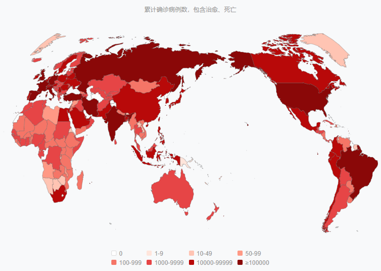
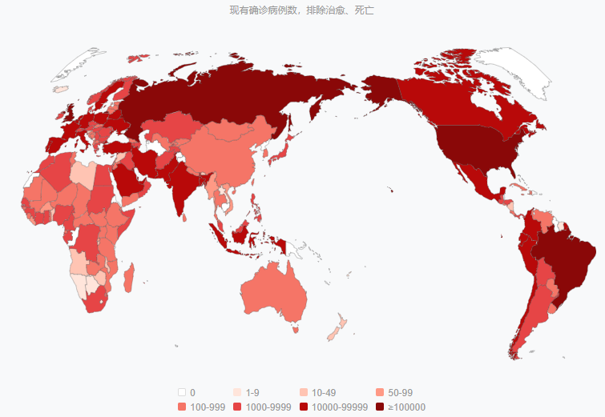
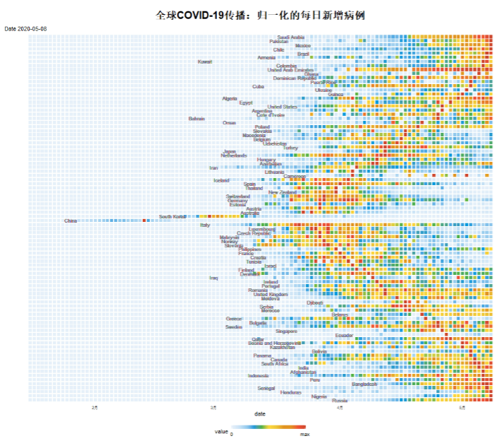
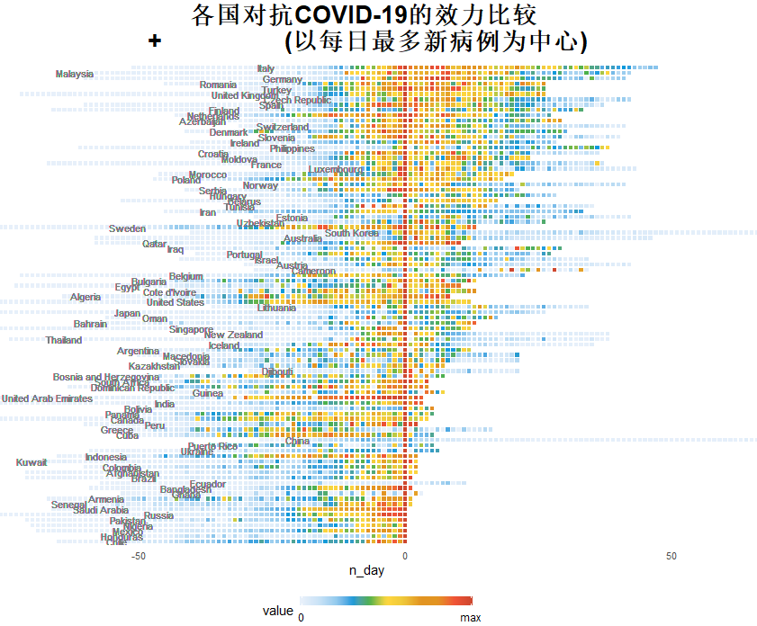
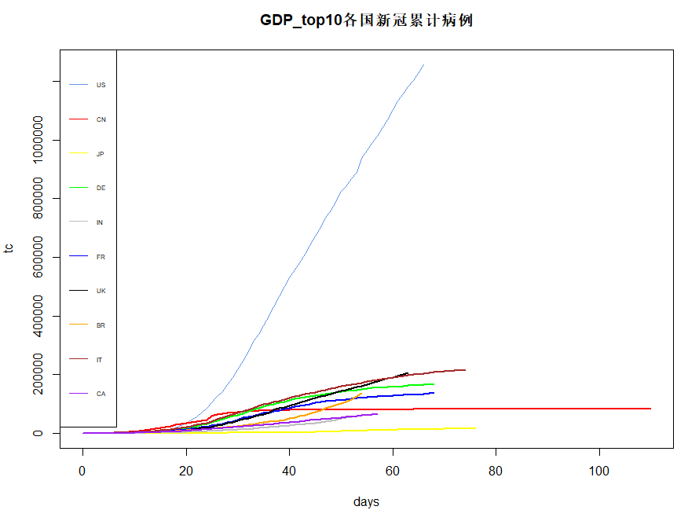
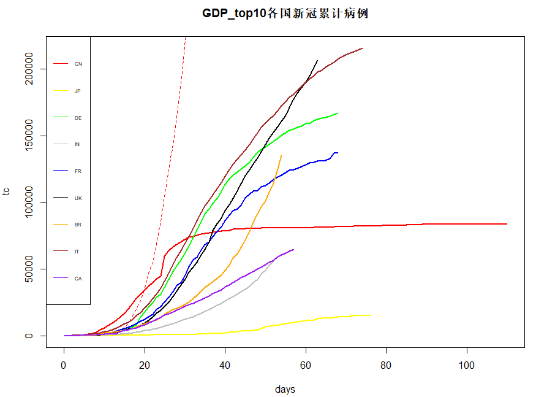

```{r setup, include=FALSE}
knitr::opts_chunk$set(echo = FALSE)
```

## 当前世界疫情情况
　　截止2020-05-19日，全球范围COVID-19累计确诊4,848,929人，现有确诊2,679,533人。

　　2月份中国成为世界疫情中心，在举国齐心协力抗疫的不懈努力下，至今本土病例多省清零，对入境病例也能做到可查可控，除少数无症状感染者还需时间检测之外，疫情得到有效防控。

　　在中国疫情得到控制之际，欧洲各国的COVID-19确诊数量开始快速增长，虽然到目前一些国家的确诊人数拐点已经出现，但是疫情还未得到控制。

　　美国COVID-19确诊病例超150万，现有确诊超110万，死亡人数超过9万，成为全球疫情中心。

---------------------------------------------
<div align="center">

</div>

---------------------------------------------
<div align="center">

</div>

## 每日新增病例比较
    
　　取2019-12-31日至2020-05-08的各国COVID-19每日新增病例的数据，对比各国COVID-19发展的速度和各国的对抗效力。[数据来源](https://covid.ourworldindata.org/data/ecdc/full_data.csv)

　　由于各个国家病例数相差较大，所以这里对每个国家/地区的新病例的进行归一化（（1）式），范围从0到1。
    
$$
f(x)=\frac {x-min(x)}{max(x)-min(x)} \tag{1}
$$

---------------------------------------------
<div align="center">

</div>

## 各国对抗COVID-19效力比较
<div align="center">

</div>

## GDP_top10 各国新冠累计病例比较
<div align="center">

</div>

---------------------------------------------
<div align="center">

</div>

